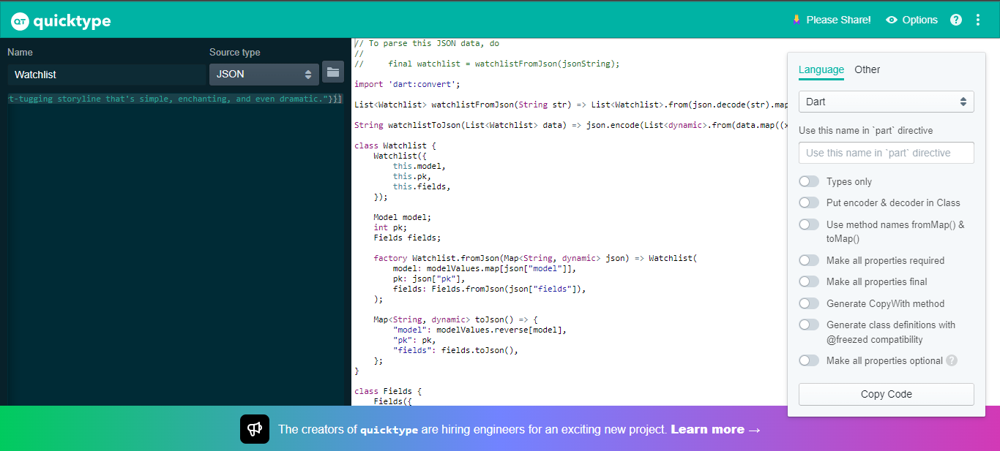

# Tugas 9 Assignment PBP

## Apakah dapat Melakukan Pengambilan Data JSON tanpa Membuat Model

Kita bisa melakukan pengambilan data JSON tanpa membuat model dengan memanggil fungsi `jsonDecode()` dari library `dart:convert`. Kemudian, fungsi tersebut mengembalikan sebuah `Map<String, dynamic>`. Dari situ kita dapat mengakses atribut data JSON. Misalkan:

JSON:
```shell
{
"name": "John Smith",
"email": "john@example.com"
}
```
Dart Code:
```shell
Map<String, dynamic> user = jsonDecode(jsonString);
print(‘Hello, ${user['name']}!');
print('We sent the verification link to ${user['email']}.');
```

Pengambilan data JSON tanpa membuat model tidak lebih baik daripada membuat model terlebih dahulu. Hal itu disebabkan karena kita tidak dapat mengetahui tipe dari atribut sebelum runtime. Sehingga kita kehilangan fitur, seperti *type safety*, *autocompletion*, dan *exception* saat compile. Selain itu dengan membuat model, pengambilan data dapat lebih terstruktur.

***

## Widget yang Digunakan

| Widget | Deskripsi | Widget | Deskripsi
| --- | --- | --- | --- |
| `Container` | Widget yang membungkus widget lain. | `DateFormat` | Formating tanggal `DateTime`. |
| `Center` | Widget yang meletakkan *child* di tengah. | `Text` | Widget yang menampilkan teks. | 
| `Column` | Widget yang menampilkan *children* di array vertikal. | `TextStyle` | Widget yang mendeksripsikan *style* yang berupa format dan warna teks. |
| `MaterialPageRoute` | Modal yang mengganti keseluruhan layar. | `Padding` | Widget yang menambahkan padding pada *child* |
| `ListView.builder` | Membuat widget dari semua item dalam array. | `FloatingActionButton` | Tombol yang melayang di atas konten |
| `FutureBuilder` | Widget yang membuat diri sendiri berdasarkan interaksi terakhir dengan `Future` | `TextSpan` | Span dari teks yang *immutable* |
| `Future` | Hasil dari komputasi asinkronus | `Text.rich` | Membuat widget teks dengan `InlineSpan` |
| `BoxDecoration` | Membuat sebuah box | 

***

## Mekanisme Pengambilan Data dari JSON hingga dapat Ditampilkan

Berikut adalah mekanisme pengambilan data dari JSON sampai dapat ditampilkan di Flutter:

1. Membuat sebuah fungsi `fetchData()` yang akan melakukan *fetch* ke URL yang diinginkan menggunakan method `http.get`. `http.get` akan mengembalikan sebuah *response*. *Response* tersebut berisi data JSON apabila *fetch*-nya berhasil.

2. Kemudian, membuat sebuah model yang berisi data di JSON. Di model tersebut tambahkan sebuah *factory constructor* yang akan mengubah semua JSON ke dalam model. Di dalam fungsi `fetchData()` panggil *factory constructor* dan kembalikan.

3. Untuk menampilkan data, kita dapat menggunakan `FutureBuilder`. Di properti *future* panggil fungsi `fetchData()` dan properti *builder* berisi *widget* berserta data yang akan ditampilkan.

***

## Implementasi

1. Menambahkan tombol navigasi pada drawer/hamburger untuk ke halaman *mywatchlist*.

    Di file `custom_drawer.dart` tambahkan sebuah `ListView` yang akan menjalankan `Navigator` saat diklik sehingga berpindah ke halaman *mywatchlist*.

    ```shell
    ListTile(
        title: const Text('My Watch List'),
        onTap: () {
            // Route menu ke halaman my watchlist
            Navigator.pushReplacement(
            context,
            MaterialPageRoute(
                builder: (context) => const MyWatchlistPage()),
            );
        },
        ),
    ```

2. Membuat satu file dart yang berisi model *mywatchlist*.

    Membuat *directory* baru bernama models dan didalamnya masukkan `budgets.dart` dan tambahkan `watchlist.dart` yang berisi model *mywatchlist*. Model tersebut didapat dari endpoint JSON Django yang dikerjakan pada Tugas 3, yaitu di url: http://tugas-2-pbp-airel.herokuapp.com/mywatchlist/json/.

    Buka situs web Quicktype, yaitu https://app.quicktype.io/ untuk mendapatkan representasi model dari data JSON. Ubah *setup name* menjadi `Watchlist`, *source type* menjadi `JSON`, serta *languange* Dart. Kemudian, *copy paste* data JSON tersebut. Terakhir. *copy paste* representasi model ke `watchlist.dart`.

    

    Kemudian, menambahkan dependensi HTTP dengan *download package* http menggunakan *command* `flutter pub add http`. Selain itu, tambahkan kode `<uses-permission android:name="android.permission.INTERNET" />` pada `android/app/src/main/AndroidManifest.xml`.

3. Menambahkan halaman mywatchlist

    Membuat file baru bernama `mywatchlist.dart`. Kemudian, membuat fungsi `fetchWatchlist()` yang akan mengambil data dari url https://tugas-2-pbp-airel.herokuapp.com/mywatchlist/json lalu mengubahnya ke model yang sudah dibuat dan akan mengembalikan list objek model tersebut.

    ```shell
    import 'package:http/http.dart' as http;
    import 'dart:convert';
    import '../models/watchlist.dart';

    Future<List<Watchlist>> fetchWatchlist() async {
    var url =
        Uri.parse('https://tugas-2-pbp-airel.herokuapp.com/mywatchlist/json');
    var response = await http.get(
        url,
        headers: {
        "Access-Control-Allow-Origin": "*",
        "Content-Type": "application/json",
        },
    );

    // melakukan decode response menjadi bentuk json
    var data = jsonDecode(utf8.decode(response.bodyBytes));

    // melakukan konversi data json menjadi object Watchlist
    List<Watchlist> listWatchlist = [];
    for (var d in data) {
        if (d != null) {
        listWatchlist.add(Watchlist.fromJson(d));
        }
    }

    return listWatchlist;
    }
    ```

    Selanjutnya, menambahkan drawer dan membuat kode yang menampilkan data pada bagian `Widget(BuildContext context)`. Data ditampilkan menggunakan widget `FutureBuilder` yang akan membuat `ListView` yang berisi `Container` dengan judul watchlist.

    ```shell
    drawer: const CustomDrawer(),
    body: FutureBuilder(
        future: fetchWatchlist(),
        builder: (context, AsyncSnapshot snapshot) {
            if (snapshot.data == null) {
            return const Center(child: CircularProgressIndicator());
            } else {
            if (!snapshot.hasData) {
                return Column(
                children: const [
                    Text(
                    "Tidak ada watchlist.",
                    style:
                        TextStyle(color: Color(0xff59A5D8), fontSize: 20),
                    ),
                    SizedBox(height: 8),
                ],
                );
            } else {
                return ListView.builder(
                    itemCount: snapshot.data!.length,
                    itemBuilder: (_, index) => InkWell(
                        child: Container(
                            margin: const EdgeInsets.symmetric(
                                horizontal: 16, vertical: 12),
                            padding: const EdgeInsets.all(20.0),
                            decoration: BoxDecoration(
                                color: Colors.white,
                                borderRadius: BorderRadius.circular(15.0),
                                boxShadow: const [
                                BoxShadow(
                                    color: Colors.black, blurRadius: 2.0)
                                ]),
                            child: Text(
                            "${snapshot.data![index].fields.title}",
                            style: const TextStyle(
                                fontSize: 18.0,
                            ),
                            ),
                        ),
                        ));
            }
            }
        });
    ```

    Dalam widget `Container`, tambahkan properti *onTap* yang akan melakukan `Navigator.push()` ke halaman detail dengan argumen data wishlist yang di klik.

    ```shell
    onTap: () {
        Navigator.push(
        context,
        MaterialPageRoute(
            builder: (context) => MyDetailPage(data: snapshot.data![index])),
        );
    },
    ``` 

4. Menambahkan halaman detail untuk setiap mywatchlist yang ada pada daftar tersebut dengan membuat file baru bernama `detail.dart`. Halaman ini menampilkan judul, release date yang sudah di format, rating, status, dan review yang dibungkus widget `Padding`.
    
    Kemudian, pembuatan setiap text menggunakan widget `Text.rich` yang memiliki properti *child* berupa list `TextSpan`. Agar *weight* teks atribut watchlist bold dan *weight* teks isi atributnya normal.

    <details>
        <summary>Kode lengkap</summary>

    ```shell
    Column(
        crossAxisAlignment: CrossAxisAlignment.start,
        children: [
        Padding(
            padding: const EdgeInsets.all(20.0),
            child: Center(
                child: Text('${widget.data.fields.title}',
                    style: const TextStyle(
                        fontSize: 30, fontWeight: FontWeight.bold)),
            )),
        Padding(
            padding: const EdgeInsets.all(10.0),
            child: Text.rich(
                TextSpan(
                text: 'Release Date: ',
                style: const TextStyle(
                    fontWeight: FontWeight.bold, fontSize: 18),
                children: <TextSpan>[
                    TextSpan(
                        text: DateFormat('MMM d, y')
                            .format(widget.data.fields.releaseDate),
                        style: const TextStyle(
                            fontWeight: FontWeight.normal, fontSize: 18)),
                ],
                ),
            )),
        Padding(
            padding: const EdgeInsets.all(10.0),
            child: Text.rich(
                TextSpan(
                text: 'Rating: ',
                style: const TextStyle(
                    fontWeight: FontWeight.bold, fontSize: 18),
                children: <TextSpan>[
                    TextSpan(
                        text: '${widget.data.fields.rating}/5',
                        style: const TextStyle(
                            fontWeight: FontWeight.normal, fontSize: 18)),
                ],
                ),
            )),
        Padding(
            padding: const EdgeInsets.all(10.0),
            child: Text.rich(
                TextSpan(
                text: 'Status: ',
                style: const TextStyle(
                    fontWeight: FontWeight.bold, fontSize: 18),
                children: <TextSpan>[
                    if (widget.data.fields.watched) ...[
                    const TextSpan(
                        text: 'Watched',
                        style: TextStyle(
                            fontWeight: FontWeight.normal, fontSize: 18)),
                    ] else ...[
                    const TextSpan(
                        text: 'Haven\'t Watched',
                        style: TextStyle(
                            fontWeight: FontWeight.normal, fontSize: 18)),
                    ]
                ],
                ),
            )),
        Padding(
            padding: const EdgeInsets.all(10.0),
            child: Text.rich(
                TextSpan(
                text: 'Review:\n',
                style: const TextStyle(
                    fontWeight: FontWeight.bold, fontSize: 18),
                children: <TextSpan>[
                    TextSpan(
                        text: '${widget.data.fields.review}',
                        style: const TextStyle(
                            fontWeight: FontWeight.normal, fontSize: 18)),
                ],
                ),
            )),
            ],
        );
    ```
    </details>

5. Membuat sebuah `FloatingActionButton` yang align di tengah. Ketika tombol ditekan, akan melakukan `Navigator.pop()` untuk kembali ke halaman mywachlist.

    ```shell
    floatingActionButtonLocation: FloatingActionButtonLocation.centerFloat,
    floatingActionButton: FloatingActionButton.extended(
        tooltip: 'Back',
        heroTag: 'Back',
        label: const Text("Back"),
        onPressed: () => Navigator.pop(
            context,
            MaterialPageRoute(
                builder: (context) => const MyWatchlistPage()))),
    ```

***

## Bonus

1. Menambahkan checkbox pada setiap watchlist pada halaman mywatchlist.

    Mengganti *child* `Container` yang tadinya `Text` judul watchlist menjadi widget `Row`. Kemudian, masukkan `Text` judul watchlist tersebut dan tambah sebuah `Checkbox`. Dalam checkbox tambahkan properti *onChanged* yang akan mengubah variabel *watched* watchlist tersebut ketika ditekan.

    ```shell
    Checkbox(
        checkColor: Colors.white,
        value: snapshot.data![index].fields.watched,
        onChanged: (bool? value) {
            setState(() {
                snapshot.data![index].fields.watched =
                    value!;
            });
        },
    ),
    ```

2. Menambahkan warna untuk outline pada setiap mywatchlist pada halaman mywatchlist berdasarkan status ditonton

    Mengubah properti *boxShadow* di `ListBuilder` menjadi sebuah *boolean expression* dimana warnanya hijau ketika watchlist sudah ditonton dan warnanya merah ketika watchlist belum ditonton.
    
    ```shell
    boxShadow: (snapshot.data![index].fields.watched) ? const [ BoxShadow(color: Colors.green, blurRadius: 2.0) ]
        : const [ BoxShadow(color: Colors.red, blurRadius: 2.0) ]),
    ```

3. *Refactor* fungsi fetch data

    Membuat file `fetch_wishlist.dart` di dalam folder `lib/widgets` dan *copy paste* fungsi fetch data yang sudah dibuat ke dalamnya. Kemudian, di `mywatchlist.dart` hapus fungsi tersebut dan tambahkan `import 'widgets/fetch_watchlist.dart';`

***

## Credits

Sumber jawaban nomor 1 adalah [Navigation, Networking, and
Integration](https://scele.cs.ui.ac.id/pluginfile.php/165589/mod_resource/content/1/10%20-%20Navigation%2C%20Networking%2C%20and%20Integration.pdf) dan [JSON and serialization](https://docs.flutter.dev/development/data-and-backend/json#which-json-serialization-method-is-right-for-me)

Sumber jawaban nomor 2 adalah [material library](https://api.flutter.dev/flutter/material/material-library.html)

Sumber jawaban nomor 3 adalah [Fetch data from the internet](https://docs.flutter.dev/cookbook/networking/fetch-data)

***

## Previous Assignment

<details>
  <summary>Tugas 8</summary>

# Tugas 8 Assignment PBP

## Perbedaan `Navigator.push` dan `Navigator.pushReplacement`

`Navigator.push` merupakan method untuk mengubah tampilan ke halaman selanjutnya. Kemudian, kita dapat kembali ke halaman sebelumnya dengan menggunakan `Navigator.pop`. Sementara dengan `Navigator.pushReplacement`, kita dapat mengubah tampilan ke halaman selanjutnya tetapi tidak dapat kembali ke halaman sebelumnya. Contoh penggunaan method `Navigator.pushReplacement` adalah ketika *user* tidak dapat mengakses halaman login setelah sudah berhasil login dan masuk ke halaman selanjutnya.

***

## Widget yang Digunakan

| Widget | Deskripsi | Widget | Deskripsi
| --- | --- | --- | --- |
| `Container` | Widget yang membungkus widget lain. | `TextFormField` | Sebuah `FormField` yang mengandung `TextField`. |
| `Center` | Widget yang meletakkan *child* di tengah. | `Text` | Widget yang menampilkan teks. | 
| `Row` | Widget yang menampilkan *children* di array horizontal. | `TextStyle` | Widget yang mendeksripsikan *style* yang berupa format dan warna teks. |
| `Column` | Widget yang menampilkan *children* di array vertikal. | `Padding` | Widget yang menambahkan padding pada *child* |
| `Drawer` | Panel yang muncul dari tepi `Scaffold` untuk menampilkan tautan navigasi. | `DateFormat` | Formating tanggal `DateTime`. |
| `MaterialPageRoute` | Modal yang mengganti keseluruhan layar. | `TextEditingController` | Controller untuk `TextField`. |
| `SingleChildScrollView` | Kotak dimana widget dapat di-*scroll*. | `DropdownButton` | Button untuk memilih list items. |
| `ListView.builder` | Membuat widget dari semua item dalam array. | `DropdownMenuItem` | Item dalam menu yang dibuat oleh `DropdownButton`. |
| `ListTile` | Baris yang berisi teks serta ikon. | `TextButton` | Button dengan sebuah teks. |
| `Card` | Panel dengan sudut yang membulat serta memiliki bayangan. | `ButtonStyle` | Widget yang mendeksripsikan *style* yang berupa format dan warna button. |

***

## Jenis-Jenis Event di Flutter

| Event | Deskripsi |
| --- | --- |
| `onChanged` | Event terjadi ketika *user* mengubah isi field. |
| `onSubmitted` | Event terjadi ketika *user* selesai mengisi field |
| `onEditingComplete` | Event terjadi ketika *user* mengirim konten yang dapat diedit. |
| `onSaved` | Event terjadi ketika memanggil `FormState.save`. |
| `onTap` | Event terjadi ketika *user* menekan layar. |
| `onFocusChanged` | Event terjadi ketika fokus pointer ke tombol berubah. |
| `onHover` | Event terjadi ketika pointer berada di atas tombol. |
| `onPressed` | Event terjadi ketika tombol ditekan. |
| `onLongPressed`| Event terjadi ketika tombol ditekan lama. |

***

## Cara Kerja `Navigator` dalam "Mengganti" Halaman

`Navigator` merupakan *widget* yang mengelola objek `Route` dalam bentuk stack. `Route` merupakan titik navigasi ke suatu halaman dalam Flutter. *Widget* `Navigator` menyediakan dua fungsi utama, yaitu dengan method `Navigator.push` dan `Navigator.pop`. `Navigator.push` merupakan method untuk *push* `Route` ke elemen atas stack sehingga mengubah tampilan ke halaman selanjutnya. Sedangkan `Navigator.pop` merupakan method untuk *pop* elemen atas stack sehingga mengubah tampilan ke halaman sebelumnya. Selain dua method tersebut, terdapat beberapa fungsi lain, seperti `Navigator.pushReplacement`, `Navigator.pushAndRemoveUntil`, dan lain-lain.

***

## Implementasi

1. Menambah drawer/hamburger menu

    Pada setiap halaman, masukkan widget `Drawer` di properti *widget* dalam `Scaffold`

    ```shell
    ...
    drawer: Drawer(
      child: Column()
    ),
    ...
    ```

2. Menambahkan tiga tombol navigasi

    Kemudian, tambahkan *children* dari `Column`, yaitu tiga buah *widget* `ListTile`. 

    ```shell
    child: Column(
        children: [
          ListTile(),
          ListTile(),
          ListTile(),
        ],
    )
    ```
    
    * `ListTile` pertama, memiliki *title* "counter_7" dan ketika di klik pergi ke `MyHomePage`. 

        ```shell
        ListTile(
            title: const Text('counter_7'),
            onTap: () {
                // Route menu ke halaman counter_7
                Navigator.pushReplacement(
                    context,
                    MaterialPageRoute(builder: (context) => const MyHomePage()),
                );
            },
        ),  
        ```
    
    * Sementara `ListView` kedua, memiliki *title* "Tambah Budget" dan ketika di klik pergi ke `MyTambahBudgetPage`. 

        ```shell
        ListTile(
            title: const Text('Tambah Budget'),
            onTap: () {
              // Route menu ke halaman tambah budget (form)
                Navigator.pushReplacement(
                    context,
                    MaterialPageRoute(
                        builder: (context) => const MyTambahBudgetPage()),
                );
            },
        ),
        ```
    
    * Dan `ListView` terakhir, memiliki *title* "Data Budget" dan ketika di klik pergi ke `MyDataBudgetPage`.

        ```shell
        ListTile(
            title: const Text('Data Budget'),
            onTap: () {
                // Route menu ke halaman data budget
                Navigator.pushReplacement(
                    context,
                    MaterialPageRoute(
                        builder: (context) => const MyDataBudgetPage()),
                );
            },
        ),
        ```

    Setelah itu, mengimpor halaman satu ke halaman yang lain. Seperti pada `lib/main.dart`:
    ```shell
    import 'package:counter_7/tambah_budget.dart';
    import 'package:counter_7/data_budget.dart';
    ```

3. Menambahkan halaman form

    Membuat file baru bernama `tambah_budget.dart`. Tambahkan *widget* `Drawer`. Dalam *body* halaman tersebut ganti *widget* `Center` menjadi `Form`, tambah *form key* dan *child*-nya sebuah `SingleChildScrollView`. Kemudian dalam *widget* tersebut, definisikan *padding* 20dp, tinggi *widget*, dan *child*-nya berupa `Column`. *children* dari `Column` adalah input yang akan diterima form.

    ```shell
    body: Form(
        key: _formKey,
        child: SingleChildScrollView(
          child: Container(
            padding: const EdgeInsets.all(20.0),
            height: MediaQuery.of(context).size.height -
                AppBar().preferredSize.height,
            child: Column(),
    ```

    * Menambah input tipe data String berupa judul budget.

        Menambahkan variabel `_judul`.
        
        ```shell
        String _judul = "";
        ```

        Menambahkan *widget* `TextFormField` yang dibungkus `Padding` sebagai *children* pertama `Column`. *Widget* tersebut dikostumisasi, akan men-*update* variabel `_judul`, dan memvalidasi input yang masuk.

        ```shell
        Padding(
            // Menggunakan padding 10 pixels
            padding: const EdgeInsets.all(10.0),
            child: TextFormField(
                decoration: InputDecoration(
                    hintText: "Contoh: Keperluan kuliah",
                    labelText: "Judul",
                    // Menambahkan circular border
                    border: OutlineInputBorder(
                    borderRadius: BorderRadius.circular(5.0),
                    ),
                ),

                // Update variabel judul saat diketik
                onChanged: (String? value) {
                    setState(() {
                    _judul = value!;
                    });
                },
                // Update variabel judul saat data disimpan
                onSaved: (String? value) {
                    setState(() {
                    _judul = value!;
                    });
                },

                // Validator sebagai validasi form
                validator: (String? value) {
                    if (value == null || value.isEmpty) {
                    return 'Judul tidak boleh kosong!';
                    }
                    return null;
                },
            ),
        ),
        ```
    

    * Menambah input tipe data int berupa nominal budget.

        Menambahkan variabel `_nominal`.

        ```shell
        int? _nominal = 0;
        ```

        Menambahkan *widget* `TextFormField` yang dibungkus `Padding` sebagai *children* kedua `Column`. *Widget* tersebut dikostumisasi, akan men-*update* variabel `_nominal`, dan memvalidasi input yang masuk hanya integer.

        ```shell
        Padding(
            // Menggunakan padding 10 pixels
            padding: const EdgeInsets.all(10.0),
            child: TextFormField(
                decoration: InputDecoration(
                    hintText: "Contoh: 20000",
                    labelText: "Nominal",
                    // Menambahkan circular border
                    border: OutlineInputBorder(
                    borderRadius: BorderRadius.circular(5.0),
                    ),
                ),

                // Update variabel nominal saat diketik
                onChanged: (String? value) {
                    setState(() {
                    _nominal = int.tryParse(value!);
                    });
                },
                // Update variabel nominal saat data disimpan
                onSaved: (String? value) {
                    setState(() {
                    _nominal = int.tryParse(value!);
                    });
                },

                // Validator sebagai validasi form
                keyboardType: TextInputType.number,
                inputFormatters: <TextInputFormatter>[
                    FilteringTextInputFormatter.digitsOnly
                ],
                validator: (String? value) {
                    if (value == null || value.isEmpty) {
                    return 'Nominal tidak boleh kosong!';
                    }
                    return null;
                },
            ),
        ),
        ```

    * Menambah dropdown  tipe budget dengan pilihan pemasukan dan pengeluaran.

        Menambahkan variabel `_jenis` dan list `_listJenis`

        ```shell
        String? _jenis = null;
        final List<String> _listJenis = ['Pemasukan', 'Pengeluaran'];
        ```

        Menambahkan *widget* `DropdownButton` sebagai *children* ketiga `Column`. *Widget* tersebut dikostumisasi dan akan men-*update* variabel `jenis` ketika salah satu jenis budget dipilih.

        ```shell
        DropdownButton(
            underline: const SizedBox(),
            value: _jenis,
            icon: const Icon(Icons.keyboard_arrow_down),
            items: _listJenis.map((String items) {
                return DropdownMenuItem(
                    value: items,
                    child: Text(items),
            );
            }).toList(),
            hint: const Text('Pilih Jenis'),
            onChanged: (String? newValue) {
                setState(() {
                    _jenis = newValue!;
            });
            },
        ),
        ```

    * Menambah button untuk menyimpan budget.

        Membuat *widget* baru yang berisi class `Budget`. Class tersebut berisi judul, nominal, dan jenis budget. Selain itu, terdapat list budget `budgets`.

        ```shell
        class Budget {
            final String judul;
            final int nominal;
            final String jenis;

            const Budget(this.judul, this.nominal, this.jenis);
        }

        List<Budget> budgets = [];
        ```

        Untuk mengakses list `budgets` perlu mengimpor *widget* tersebut ke halaman yang membutuhkannya, yaitu `lib/tambah_budget.dart` dan `lib/data_budget.dart`.

        ```shell
        import '../widgets/budgets.dart';
        ```
        
        Menambahkan *widget* `Spacer` sebelum `TextButton` untuk menambah margin agar tombol simpan dapat berada di bawah. Kemudian, menambah `TextButton` sebagai *children* kelima `Column`. *Widget* tersebut dikostumisasi dan ketika form valid, akan menambah sebuah objek budget ke list `budgets`.

        ```shell
        const Spacer(),
        TextButton(
            style: ButtonStyle(
            backgroundColor: MaterialStateProperty.all(Colors.blue),
            ),
            onPressed: () {
            if (_formKey.currentState!.validate()) {
                // Menambah budget
                if (_jenis != null) {
                budgets.add(Budget(_judul, _nominal!, _jenis!));
                }
            }
            },
            child: const Text(
                "Simpan",
                style: TextStyle(color: Colors.white),
            ),
        ),
        ```

4. Menambahkan halaman data *budget*

    Membuat file baru bernama `data_budget.dart`. Tambahkan *widget* `Drawer`. Dalam *body* halaman tersebut membuat sebuah *boolean expression*. Apabila list `budgets` kosong tampilkan `Center` kosong. Sedangkan jika ada isinya, akan menjalankan `ListView.builder`. `ListView.builder` akan membuat `ListView` dengan *children* `Card` berdasarkan data dari list `budgets`.

    ```shell
    body: budgets.isEmpty
          ? const Center()
          : ListView.builder(
                itemCount: budgets.length,
                itemBuilder: (context, index) {
                    return Card(),
                },
            ),
    ```

    *Widget* `Card` akan memiliki *child* berupa `ListTile`. Kemudian, menambahkan *title* dan *subtitle* dari setiap `ListTile` berdasarkan data list `budgets`. *Subtitle* dari `ListTile` berupa `Row` dengan *space between alignment* sehingga *children* pertama, yaitu `Text` nominal berada di kiri dan *children* kedua, yaitu `Text` jenis budget berada di kanan. Terakhir, mengubah font size setiap *widget* `Text`.

    ```shell
    Card(
        child: ListTile(
            title: Column(
                crossAxisAlignment: CrossAxisAlignment.start,
                children: [
                    Padding(
                    padding: const EdgeInsets.symmetric(vertical: 5),
                    child: Text(
                        budgets[index].judul,
                        style: const TextStyle(fontSize: 22),
                    ),
                ),],
            ),
            subtitle: Row(
                mainAxisAlignment: MainAxisAlignment.spaceBetween,
                children: [
                Text(
                    budgets[index].nominal.toString(),
                    style: const TextStyle(fontSize: 14),
                ),
                Text(
                    budgets[index].jenis,
                    style: const TextStyle(fontSize: 14),
                ),
            ]),
        )
    );
    ```

***

## Bonus

1. Menambahkan elemen date picker

    Di class `Budget`, menambah properti dateTime berupa String tanggal yang dipilih

    ```shell
    class Budget {
        final String judul;
        final int nominal;
        final String jenis;
        final String dateTime;

        const Budget(this.judul, this.nominal, this.jenis, this.dateTime);
    }

    List<Budget> budgets = [];
    ```

    Menambahkan variabel `_dateTime` dan `dateController`.

    ```shell
    String _dateTime = "";
    TextEditingController dateController = TextEditingController();
    ```

    Menambahkan *widget* `TextFormField` yang dibungkus `Padding` sebagai *children* `Column`. *Widget* tersebut dikostumisasi. Ketika *widget* di klik akan memanggil fungsi `showDatePicker` yang akan memunculkan *date picker*. Ketika *user* sudah memilih tanggal, akan men-*update* variabel `_dateTime` dan `dateController`. `dateController` digunakan untuk menampilkan tanggal di *text field*.

    ```shell
    Padding(
        // Menggunakan padding 10 pixels
        padding: const EdgeInsets.all(10.0),
        child: TextFormField(
        controller: dateController,
        readOnly: true,
        decoration: InputDecoration(
            hintText: "Tanggal",
            labelText: "Tanggal",
            // Menambahkan circular border
            border: OutlineInputBorder(
            borderRadius: BorderRadius.circular(5.0),
            ),
        ),

        onTap: () {
            showDatePicker(
                context: context,
                initialDate: DateTime.now(),
                firstDate: DateTime(2000),
                lastDate: DateTime(2099),
                ).then((value) {
                    if (value != null) {
                        setState(() {
                        _dateTime = DateFormat('yyyy-MM-dd').format(value);
                        dateController.text = _dateTime;
                        }
                    );
                }
            });
        },

        // Validator sebagai validasi form
        validator: (String? value) {
            if (value == null || value.isEmpty) {
            return 'Tanggal tidak boleh kosong!';
            }
            return null;
        },
        ),
    ),
    ```

2. Menampilkan elemen date pada setiap elemen *budget*

    Pada properti *title* `Card`, mengganti `Padding` dengan *widget* `Column` yang *children*-nya dua `Padding` yang membungkus masing-masing `Text` judul dan tanggal.

    ```shell
    Column(
        crossAxisAlignment: CrossAxisAlignment.start,
        children: [
            Padding(
                padding: const EdgeInsets.symmetric(vertical: 5),
                child: Text(
                    budgets[index].judul,
                    style: const TextStyle(fontSize: 20),
                ),
            ),
            Padding(
                padding: const EdgeInsets.symmetric(vertical: 5),
                child: Text(
                    budgets[index].dateTime,
                    style: const TextStyle(fontSize: 16),
                ),
            ),
        ],
        ),
        ```

3. Refactor widget Drawer ke file terpisah

    Membuat file baru, yaitu `/lib/widgets/custom_drawer.dart` dan membuat class bernama `CustomDrawer`. Dalam *custom widget* tersebut masukkan *widget* `Drawer` yang sudah dibuat kedalamnya.

    ```shell
    class CustomDrawer extends StatelessWidget {
        const CustomDrawer({
            super.key,
        });

        @override
        Widget build(BuildContext context) {
            return Drawer( ... )
        }
    }
    ```

    Impor widget `CustomDrawer` ke setiap halaman dan mengganti `Drawer` di properti *drawer* dengan *custom widget* tersebut.

    ```shell
    import '../widgets/custom_drawer.dart';
    
    class _MyDataBudgetPageState extends State<MyDataBudgetPage> {
        @override
        Widget build(BuildContext context) {
            ...
                drawer: const CustomDrawer(),
            ...
        }
    }
    ```

***

## Credits

Sumber jawaban nomor 1 adalah [Flutter – Navigasi Antar Halaman](https://ngasturi.id/2020/01/04/flutter-navigasi-antar-halaman/)

Sumber jawaban nomor 2 adalah [material library](https://api.flutter.dev/flutter/material/material-library.html)

Sumber jawaban nomor 3 adalah [TextField class](https://api.flutter.dev/flutter/material/TextField-class.html) dan [TextButton class](https://api.flutter.dev/flutter/material/TextButton-class.html)

Sumber jawaban nomor 4 adalah [Handbook for Navigation in Flutter](https://mutualmobile.com/blog/handbook-for-navigation-in-flutter)

***

</details>

<details>
  <summary>Tugas 7</summary>

# Tugas 7 Assignment PBP

##  *Stateless Widget* dan *Stateful Widget* Beserta Perbedaan
*Stateless widget* adalah widget yang tidak dapat diubah atau *immutable* sehingga properti dan penampilan tetap. Contohnya adalah widget `Text()` dan `Icon()`.

*Stateful widget* adalah widget yang dapat diubah atau *mutable* sehingga properti dapat berubah saat runtime. Perubahan terjadi ketika app merespons event yg dipicu interaksi user. Contohnya adalah widget `Checkbox()`, `Radio()`, dan `Slider()`.

Perbedaan *Stateless Widget* dan *Stateful Widget*:
| *Stateless Widget* | *Stateful Widget* |
| --- | --- |
| Widget statik | Widget dinamik |
| Tidak berubah ketika user interaksi | Dapat berubah ketika user berinteraksi |
| Hanya di-*render* sekali dan berubah hanya ketika data eksternal berubah juga | Dapat di-*render* berulang kali apabila data yang dimasukkan berubah atau *state* widget berubah |

***

## Widget yang Digunakan

| Widget | Deskripsi |
| --- | --- |
| `Stack()` | Widget yang memposisikan `children` relatif terhadap tepian kotak. |
| `Positioned()` | Widget yang mengatur posisi `child` di `Stack()`. |
| `FloatingActionButton()` | Widget berupa tombol sirkular di atas konten. |
| `Icon()` | Widget berupa ikon yang dijelaskan di `IconData`. |
| `Center()` | Widget yang meletakkan `child` di tengah. |
| `Column()` | Widget yang menampilkan `children` di array vertikal. |
| `Text()` | Widget yang menampilkan teks. |
| `TextStyle()` | Widget yang mendeksripsikan `style` yang berupa format dan warna teks. |

***

## Fungsi dari `setState()`

Fungsi setState() memberi notifikasi ke *framework* ketika *state* objek tersebut berubah dan menyebabkan *user interface* harus diperbarui. *Framework* akan membangun kembali objek dengan *state* baru tersebut. Variabel yang berdampak pada `setState()` adalah variabel di fungsi yang di-*pass* sebagai argumen setState(). 

***

## Perbedaan `const` dan `final`

| `const` | `final` |
| --- | --- |
| Diinisiasi saat *compile time* dan sudah ditetapkan saat *runtime* sehingga tidak dapat diubah | Diinisiasi saat *runtime* dan dapat ditetapkan sekali |
| Dapat ditentukan dalam *class* dan fungsi | Dapat ditentukan dalam fungsi saja |
| Jika *state* di-*update*, variabel akan diinisiasi lagi | Jika *state* di-*update*, variabel tidak diinisiasi | 
| Digunakan jika *value* tidak diubah saat kode dijalankan | Digunakan jika *value* tidak diketahui saat *compile time* | 

***

## Implementasi

1. Membuat program Flutter baru dengan menjalankan kode ```flutter create counter_7``` di command line.

2. Mengubah tampilan

    Mengubah `title` di widget `MaterialApp()` dan `MyHomePage()` menjadi 
    "Program Counter".

    ```shell
    Widget build(BuildContext context) {
        return MaterialApp(
        title: 'Program Counter',
        theme: ThemeData(
            primarySwatch: Colors.blue,
        ),
        home: const MyHomePage(title: 'Program Counter'),
        );
    }
    ```

     Mengatur lokasi dari *floating action button* ke tengah di properti `floatingActionButtonLocation`.
    
    ```shell
    floatingActionButtonLocation: FloatingActionButtonLocation.centerFloat,
    ```

    Di properti `floatingActionButton`, menambahkan widget `Stack()` agar app dapat menggunakan lebih dari satu widget `FloatingActionButton()`. Kemudian, masukkan list widget di properti `child Stack()` yang berisi widget `Positioned()` untuk mengatur posisi dari tombol - di layar, yaitu 20dp dari kiri dan 10dp dari bawah. Kemudian, `child` dari widget tersebut adalah sebuah *floating action button*. Isi propertinya adalah `child` berupa ikon -, `heroTag` serta `tooltip` sebuah string "Decrement", dan akan menjalankan fungsi `_decrementCounter` saat di klik.

    Dalam list widget di properti `child Stack()` tambahkan lagi widget `Positioned()` untuk mengatur posisi dari tombol + di layar, yaitu 20dp dari kanan dan 10dp dari bawah. Selanjutnya, `child` dari widget tersebut adalah sebuah *floating action button*. Isi propertinya adalah `child` berupa ikon +, `heroTag` serta `tooltip` sebuah string "Increment", dan akan menjalankan fungsi `_incrementCounter` saat di klik.

    ```shell
    floatingActionButton: Stack(
        children: <Widget>[
            Positioned(
                left: 20,
                bottom: 10,
                child: FloatingActionButton(
                    onPressed: _decrementCounter,
                    tooltip: 'Decrement',
                    heroTag: 'Decrement',
                    child: const Icon(Icons.remove),
                    ),
                ),
            Positioned(
                right: 20,
                bottom: 10,
                child: FloatingActionButton(
                    onPressed: _incrementCounter,
                    tooltip: 'Increment',
                    heroTag: 'Increment',
                    child: const Icon(Icons.add),
                    ),
                ),
        ],
    ),
    ```

3. Implementasi logika
    * Untuk tombol + akan menjalankan fungsi `_incrementCounter` yang akan *increment* variabel `_counter` dan menampilkannya.

        ```shell
        void _incrementCounter() {
            setState(() {
            _counter++;
            });
        }
        ```

    * Untuk tombol - akan menjalankan fungsi `_decrementCounter` yang akan *decrement* variabel `_counter` dan menampilkannya sampai bernilai 0. Apabila lebih kecil dari nilai 0, tidak memiliki efek apapun pada `_counter`.

        ```shell
        void _decrementCounter() {
        setState(() {
            _counter--;
            if (_counter < 0) {
                _counter = 0;
            }
            });
        }
        ```

    * Untuk menampilkan text yang berubah apabila bernilai ganjil dan genap, di `children` widget `Column()` dari body app, tambahkan sebuah *if statement*. *If statement* tersebut memiliki kondisi `_counter % 2 == 0` sehingga akan memilih widget `Text()` bertulisan "GENAP" yang berwarna merah apabila `_counter` genap dan memilih widget `Text()` bertulisan "GANJIL" yang berwarna biru apabila `_counter` ganjil.

        ```shell
        if (_counter % 2 == 0) ...[
            const Text(
            'GENAP',
            style: TextStyle(color: Colors.red),
            ),
        ] else ...[
            const Text(
            'GANJIL',
            style: TextStyle(color: Colors.blue),
            ),
        ],
        ```

***

## Bonus
Untuk menghilangkan tombol - apabila counter bernilai 0, tambahkan *if statement* pada widget tombol tersebut. Apabila `_counter` lebih dari sama dengan 0, maka tampilkan widget `Positioned()` tombol - dan jika kurang dari 0 dihilangkan.

```shell
...
if(_counter > 0)
    Positioned(
        left: 20,
        bottom: 10,
        child: FloatingActionButton(
            onPressed: _decrementCounter,
            tooltip: 'Decrement',
            heroTag: null,
            child: const Icon(Icons.remove),
            ),
        ),
...
```

***

## Credits

Sumber jawaban nomor 1 adalah [Difference Between Stateless and Stateful Widget in Flutter](https://www.geeksforgeeks.org/difference-between-stateless-and-stateful-widget-in-flutter/?ref=rp)

Sumber jawaban nomor 2 adalah [material library](https://api.flutter.dev/flutter/material/material-library.html)

Sumber jawaban nomor 3 adalah [setState() method](https://api.flutter.dev/flutter/widgets/State/setState.html)

Sumber jawaban nomor 4 adalah [Difference between Const and Final in Dart](https://itnext.io/difference-between-const-and-final-in-dart-78c129d0c573)
</details>